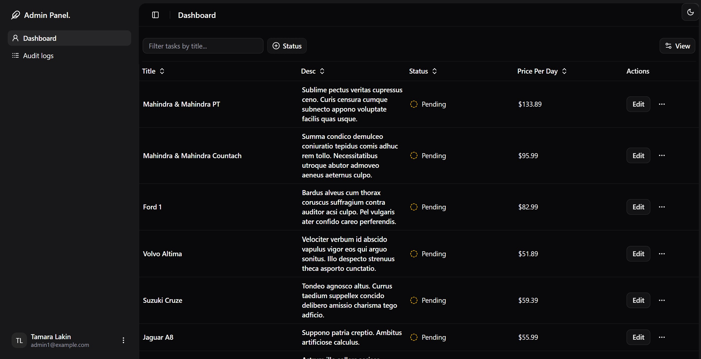
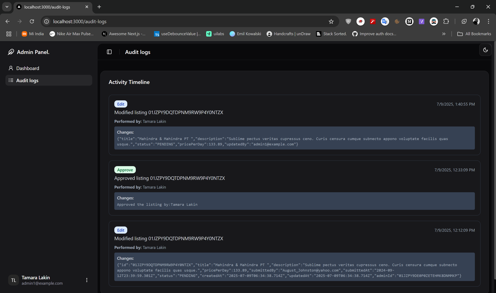
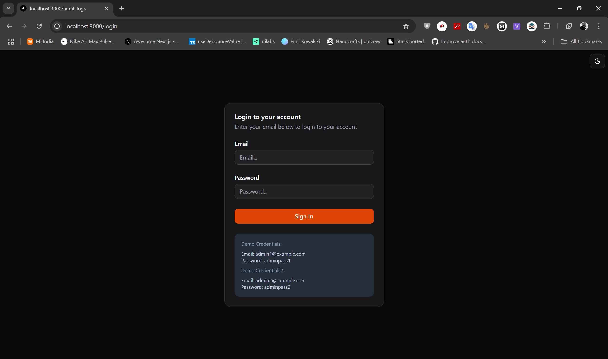

# Admin Dashboard

This is a modern Admin Dashboard web application built with [Next.js](https://nextjs.org). It provides a clean and intuitive interface for managing users, tasks, and viewing audit logs. The app features authentication, a responsive sidebar, and interactive data tables.

## Features

- **Dashboard**: Overview of key metrics and quick access to main sections.
- **Audit Logs**: Track user actions and system events for transparency and security.
- **Login**: Secure authentication for admin access.
- **Modern UI**: Responsive and visually appealing design.

## Screenshots

### Dashboard


### Audit Logs


### Login



## Getting Started

First install, then run the development server:

```bash
npm i
npm run dev
# or
yarn 
yarn dev
# or
pnpm i
pnpm dev
# or
bun i
bun dev
```

Open [http://localhost:3000](http://localhost:3000) with your browser to see the result.


## License

This project is licensed under the MIT License.
